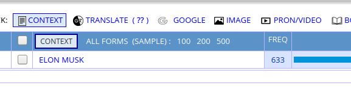
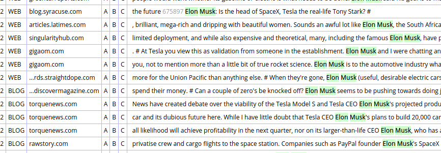

# Introduction
Corpus of Contemporary American English or COCA is one of the most widely used corpus of English.  
In this task, we will explore COCA and study about any public figure or phenomenon, and analyse the same.

### Topic Searched: Elon Musk

## Observations and Findings:

### List Search Result:

  
Freqency Count:

  
  
Frequency of appearance: 633

  
Freqency Context:

  
  
Majorly, the word appears in blogs and articles.

### Frequency Chart Result:

  
  

#### Inference:
Although Musk was one of the founders of Paypal(Founded in 1998) and earlier founded Zip2 with his brother Kimbal, he didn't get the limelight he deserved. This can be seen from the fact, that during that time, his name appeared only twice(2 times) on the internet. 
Musk founded Spacex in 2002 and gets in contact with Tesla during 2004. This phase during 2000-2005 basically laid the foundation of future, in a way. During these years too, musk couldn't capture much light. In fact, the two mentions he got are from his failed attempt to buy rockets for Mars, which later caused him to start Spacex in 2002. 
During 2005-2009, Musk started getting recognition as an entrepreneur. During this time, he got featured for Tesla, SolarCity, as well his entrepreneurship, mainly on News and Magazines. 
After 2010, Musk became a relatively common name mainly for the Magazines, Forbes, etc, and is the part we majorly know about!!

